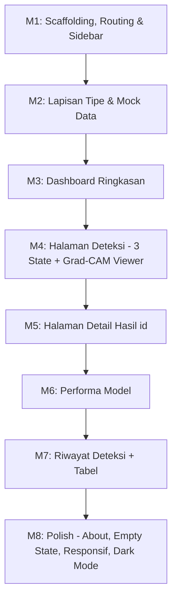

# Rencana Pengembangan UI MVP — CitraDetect (Versi Lengkap)

Dokumen ini merupakan penyempurnaan dari rencana MVP sebelumnya, disesuaikan penuh dengan **PRD.md** dan **SRS.md**. Fokus dokumen: **pembangunan kerangka (scaffolding), detail UI per halaman, dan struktur routing yang jelas** — sebelum integrasi backend Python (CNN Engine & Grad-CAM).

---

## 1. Ringkasan Lingkup MVP

| Aspek | Keputusan MVP |
| :--- | :--- |
| Input | Hanya citra statis RGB (JPG/PNG/WebP), sesuai batasan SRS — tanpa video & tanpa teks/caption |
| Model | Satu model klasifikasi: CNN (hasil disimulasikan dengan mock data di fase UI) |
| XAI | Visualisasi Grad-CAM heatmap (overlay + side-by-side) |
| Evaluasi | Akurasi, Presisi, Recall, F1-Score + Confusion Matrix + kurva training |
| Pengguna | Satu peran utama: **Peneliti** (sesuai Diagram Konteks SRS) — tanpa autentikasi multi-role di MVP |
| Data | Mock/dummy data terpusat (`lib/mock-data.ts`) agar mudah diganti API call saat integrasi |

**Prinsip fase UI:** semua halaman berfungsi penuh secara visual dan interaktif menggunakan data simulasi, dengan kontrak data yang identik dengan respons API backend nantinya (lihat Bagian 7).

---

## 2. Arsitektur Routing (Sitemap Lengkap)

Struktur rute menggunakan **Next.js App Router** dengan satu route group dashboard:

```
app/
├── page.tsx                          → redirect ke /dashboard
├── layout.tsx                        → RootLayout (font, theme provider, metadata global)
│
└── dashboard/
    ├── layout.tsx                    → DashboardLayout (Sidebar + Header + Breadcrumb)
    ├── page.tsx                      → [R1] Dashboard / Ringkasan
    │
    ├── detection/
    │   ├── page.tsx                  → [R2] Deteksi Citra (upload → proses → hasil)
    │   └── [id]/
    │       └── page.tsx              → [R3] Detail Hasil Deteksi (Grad-CAM penuh)
    │
    ├── performance/
    │   └── page.tsx                  → [R4] Performa Model (metrik, CM, kurva training)
    │
    ├── history/
    │   └── page.tsx                  → [R5] Riwayat Deteksi (tabel data)
    │
    └── about/
        └── page.tsx                  → [R6] Tentang Sistem (opsional, info batasan & metodologi)
```

### Tabel Rute & Navigasi

| ID | Rute | Menu Sidebar | Ikon (`@tabler/icons-react`) | Sumber Kebutuhan |
| :--- | :--- | :--- | :--- | :--- |
| R1 | `/dashboard` | Dashboard | `IconLayoutDashboard` | PRD §5 (Output Dashboard) |
| R2 | `/dashboard/detection` | Deteksi Citra | `IconScan` / `IconPhotoScan` | PRD §5 (Input, Preprocessing, CNN, Grad-CAM) |
| R3 | `/dashboard/detection/[id]` | — (dari R2/R5) | — | PRD §6 (Halaman Hasil) |
| R4 | `/dashboard/performance` | Performa Model | `IconChartBar` | SRS §2 (Kalkulasi Metrik Evaluasi) |
| R5 | `/dashboard/history` | Riwayat Deteksi | `IconHistory` | Kebutuhan turunan (audit hasil peneliti) |
| R6 | `/dashboard/about` | Tentang Sistem | `IconInfoCircle` | SRS §1 (Batasan Sistem — transparansi) |

### Aturan Routing

- Root `/` melakukan `redirect('/dashboard')` (server-side, via `next/navigation`).
- Rute detail `[id]` menerima ID hasil deteksi; jika ID tidak ditemukan → tampilkan `not-found.tsx` khusus dengan tombol kembali ke Riwayat.
- Metadata per halaman (judul tab browser):
  - Global: `CitraDetect — AI Image Detection System`
  - Per halaman: `Deteksi Citra | CitraDetect`, `Performa Model | CitraDetect`, dst.
- Breadcrumb otomatis di header berdasarkan segmen rute (mis. `Dashboard / Deteksi Citra / Hasil #123`).

---

## 3. Kerangka Layout & Komponen Global

### 3.1 `app/dashboard/layout.tsx`
Susunan kerangka utama (mengadaptasi template shadcn dashboard):

```
┌─────────────────────────────────────────────┐
│ Sidebar (collapsible)  │  Header             │
│  • Logo CitraDetect    │   • SidebarTrigger  │
│  • NavMain (4–5 menu)  │   • Breadcrumb      │
│  • NavSecondary        │   • ThemeToggle     │
│    (Tentang Sistem)    ├─────────────────────│
│  • Footer user/versi   │  <children />       │
│                        │  (konten halaman)   │
└─────────────────────────────────────────────┘
```

### 3.2 Komponen Bersama (Shared Components)

| Komponen | File | Digunakan di | Fungsi |
| :--- | :--- | :--- | :--- |
| `AppSidebar` | `components/app-sidebar.tsx` | Semua | Navigasi utama, branding CitraDetect |
| `SiteHeader` | `components/site-header.tsx` | Semua | Breadcrumb + trigger sidebar + toggle tema |
| `PredictionBadge` | `components/prediction-badge.tsx` | R1, R2, R3, R5 | Badge label: hijau = *Asli*, merah/oranye = *AI-Generated* |
| `ConfidenceBar` | `components/confidence-bar.tsx` | R2, R3, R5 | Progress bar persentase keyakinan model |
| `GradcamViewer` | `components/gradcam-viewer.tsx` | R2, R3 | Side-by-side + overlay heatmap dengan slider opacity |
| `MetricCard` | `components/metric-card.tsx` | R1, R4 | Kartu statistik tunggal (nilai + tren + ikon) |
| `EmptyState` | `components/empty-state.tsx` | R2, R5 | Tampilan kosong (belum ada data/unggahan) |
| `ProcessingStepper` | `components/processing-stepper.tsx` | R2 | Indikator tahapan: Upload → Preprocessing → Klasifikasi → Grad-CAM |

### 3.3 Lapisan Data Mock

- `lib/types.ts` — definisi TypeScript: `DetectionResult`, `ModelMetrics`, `ConfusionMatrix`, `EpochPoint`.
- `lib/mock-data.ts` — data simulasi terpusat (riwayat deteksi, metrik model, kurva epoch).
- `lib/api.ts` — fungsi async tiruan (`detectImage()`, `getMetrics()`, `getHistory()`) dengan `setTimeout` 1–2 detik untuk mensimulasikan latensi backend. **Saat integrasi, hanya file ini yang diganti dengan `fetch` ke FastAPI/Flask.**

---

## 4. Detail Spesifikasi Per Halaman

### R1 — Dashboard / Ringkasan (`/dashboard`)

**Tujuan:** ringkasan cepat aktivitas sistem untuk peneliti (PRD §5: dashboard output transparan).

**Susunan section (atas → bawah):**

1. **Section Cards** (4 kartu, grid responsif 1→2→4 kolom):
   | Kartu | Konten | Indikator |
   | :--- | :--- | :--- |
   | Total Deteksi | Jumlah total citra diproses | Tren mingguan (↑/↓) |
   | Citra AI Terdeteksi | Jumlah + persentase | Badge oranye |
   | Citra Asli Terdeteksi | Jumlah + persentase | Badge hijau |
   | Akurasi Model | Nilai akurasi CNN aktif (mis. 94.2%) | Status model: *Ready* |

2. **Grafik Area Interaktif:** tren frekuensi deteksi per hari (toggle 7/30/90 hari), dua seri data: *AI-Generated* vs *Asli* (stacked area, Recharts).

3. **Tabel "Deteksi Terbaru"** (5 baris terakhir): thumbnail, nama file, label, confidence, waktu — dengan tautan "Lihat semua →" ke `/dashboard/history`.

4. **Kartu Aksi Cepat:** tombol besar "Mulai Deteksi Baru" → `/dashboard/detection`.

**State kosong:** jika belum ada riwayat, tampilkan `EmptyState` dengan CTA unggah pertama.

---

### R2 — Deteksi Citra (`/dashboard/detection`)

**Tujuan:** alur inti sesuai *Activity Diagram* PRD §6 (Upload → Preprocessing → CNN → Klasifikasi → Grad-CAM → Hasil). Halaman ini adalah **single-page flow dengan 3 state UI**:

#### State A — Upload (default)
- **Dropzone** drag-and-drop (komponen `react-dropzone` atau native): area besar bergaris putus-putus, ikon upload, teks "Tarik & letakkan citra, atau klik untuk memilih".
- **Validasi sisi klien:**
  - Format: hanya `image/jpeg`, `image/png`, `image/webp` (RGB — sesuai batasan SRS).
  - Ukuran maksimum: 10 MB.
  - Tolak file video/dokumen dengan toast error: *"Sistem hanya mendukung citra statis format RGB."*
- **Pratinjau:** setelah file valid, tampilkan thumbnail + nama file + ukuran + dimensi piksel, dengan tombol "Ganti Gambar" dan "Mulai Analisis".

#### State B — Processing
- **`ProcessingStepper`** menampilkan 4 tahap berurutan dengan animasi:
  1. ✅ Citra diterima
  2. 🔄 Preprocessing (resize 224×224 + normalisasi) — sesuai SRS §2
  3. 🔄 Klasifikasi CNN (ekstraksi fitur: ketajaman, tekstur, artefak kompresi)
  4. 🔄 Pembangkitan Grad-CAM
- Skeleton/spinner di area hasil; tombol dinonaktifkan selama proses.

#### State C — Hasil
- **Panel Hasil Klasifikasi** (kartu utama):
  - `PredictionBadge` besar: **AI-Generated** (oranye/merah) atau **Asli** (hijau).
  - `ConfidenceBar`: persentase keyakinan (mis. 98.7%).
  - Waktu eksekusi (detik) + timestamp.
- **Panel Grad-CAM (`GradcamViewer`)** — dua mode (tab):
  - **Side-by-Side:** citra asli | citra heatmap, berdampingan.
  - **Overlay:** heatmap ditimpa di atas citra asli + **slider opacity 0–100%** agar peneliti dapat menelusuri area piksel paling berpengaruh (PRD §5: Explainable AI).
- **Panel Konteks Model** (collapsible): akurasi, presisi, recall, F1-score model aktif sebagai referensi keandalan (PRD §5 poin terakhir) + tautan "Detail performa →" ke R4.
- **Aksi lanjutan:** tombol "Simpan ke Riwayat", "Deteksi Citra Lain" (reset ke State A), "Unduh Hasil (PNG heatmap)".

---

### R3 — Detail Hasil Deteksi (`/dashboard/detection/[id]`)

**Tujuan:** halaman permanen satu hasil deteksi, dibuka dari tabel Riwayat atau setelah penyimpanan hasil.

**Konten:**
- Header: nama file + ID deteksi + tanggal + tombol kembali (breadcrumb).
- `GradcamViewer` ukuran penuh (mode overlay default + slider opacity).
- Kartu metadata: dimensi asli, ukuran file, hasil preprocessing (224×224), waktu eksekusi.
- `PredictionBadge` + `ConfidenceBar`.
- Aksi: "Unduh Heatmap", "Hapus dari Riwayat" (dengan dialog konfirmasi).

---

### R4 — Performa Model (`/dashboard/performance`)

**Tujuan:** transparansi evaluasi model untuk akademisi (SRS §2: Kalkulasi Metrik Evaluasi).

**Susunan section:**

1. **4 Kartu Metrik Utama** (`MetricCard`): **Akurasi, Presisi, Recall, F1-Score** — masing-masing dengan nilai persentase + deskripsi singkat satu kalimat tentang makna metrik (membantu pengguna umum memahami).

2. **Confusion Matrix** (komponen `confusion-matrix.tsx`):
   - Grid 2×2: *Actual (Asli/AI)* × *Predicted (Asli/AI)*.
   - Intensitas warna sel proporsional terhadap nilai (pola heatmap).
   - Tooltip per sel: TP/TN/FP/FN + jumlah sampel.

3. **Kurva Pelatihan** (2 line chart Recharts, tab atau berdampingan):
   - **Training vs Validation Accuracy** per epoch.
   - **Training vs Validation Loss** per epoch.
   - Legend interaktif + tooltip nilai per titik epoch.

4. **Kartu Informasi Model** (statis): arsitektur CNN yang digunakan, ukuran input (224×224 RGB), jumlah kelas (2), tanggal pelatihan terakhir, jumlah dataset latih/uji (citra AI-generated + citra asli feed Instagram — sesuai SRS §3 Data Requirements).

---

### R5 — Riwayat Deteksi (`/dashboard/history`)

**Tujuan:** audit seluruh pengujian yang pernah dilakukan peneliti.

**Tabel data** (adaptasi `components/data-table.tsx`, TanStack Table):

| Kolom | Konten | Fitur |
| :--- | :--- | :--- |
| Thumbnail | Pratinjau 48×48 px | Klik → buka R3 |
| Nama File | string + ekstensi | Sortable, searchable |
| Prediksi | `PredictionBadge` | Filter dropdown: Semua / Asli / AI |
| Confidence | `ConfidenceBar` mini + angka | Sortable |
| Tanggal | format relatif + absolut (tooltip) | Sortable (default: terbaru) |
| Aksi | Dropdown: Lihat Grad-CAM (→ R3), Unduh, Hapus | — |

**Fitur tabel:**
- Search bar global (nama file).
- Filter berdasarkan label prediksi.
- Pagination (10/25/50 baris per halaman).
- `EmptyState` jika belum ada riwayat + CTA ke R2.
- (Opsional) tombol "Export CSV" untuk kebutuhan analisis peneliti.

---

### R6 — Tentang Sistem (`/dashboard/about`) — *opsional tapi direkomendasikan*

**Tujuan:** mengkomunikasikan batasan sistem secara transparan (langsung dari SRS §1) — penting untuk kredibilitas akademik tugas akhir.

**Konten (statis):**
- Deskripsi singkat tujuan sistem (deteksi kualitas visual citra AI-generated dari feed Instagram + XAI Grad-CAM).
- Daftar batasan: hanya citra statis RGB, tanpa video, tanpa analisis caption, satu model CNN, objek campuran (wajah & objek umum).
- Penjelasan singkat metodologi: alur IPO (Input → Preprocessing → CNN → Grad-CAM → Output).
- Sumber data: dataset publik + citra feed Instagram.

---

## 5. Milestone Implementasi (Revisi & Diperluas)



### M1 — Scaffolding, Routing & Sidebar *(prioritas pertama)*
- [ ] Bersihkan menu bawaan template di `components/app-sidebar.tsx`; sisakan 5 menu (R1, R2, R4, R5 + R6 di NavSecondary).
- [ ] Pasang ikon `@tabler/icons-react` sesuai tabel rute.
- [ ] Buat seluruh folder & file rute (R1–R6) dengan placeholder `<h1>` agar navigasi langsung bisa diuji.
- [ ] Redirect `/` → `/dashboard`.
- [ ] Set metadata global & per halaman.
- [ ] Komponen breadcrumb dinamis di `site-header.tsx`.

### M2 — Lapisan Tipe & Mock Data
- [ ] `lib/types.ts`: `DetectionResult`, `ModelMetrics`, `ConfusionMatrix`, `EpochPoint`.
- [ ] `lib/mock-data.ts`: ±20 entri riwayat dummy, metrik model, 30 titik epoch.
- [ ] `lib/api.ts`: fungsi async simulasi dengan delay buatan.

### M3 — Dashboard Ringkasan (R1)
- [ ] Refaktor `section-cards.tsx` → 4 kartu statistik CitraDetect.
- [ ] Refaktor `chart-area-interactive.tsx` → tren deteksi harian 2 seri.
- [ ] Tabel mini "Deteksi Terbaru" + CTA deteksi baru.

### M4 — Halaman Deteksi (R2)
- [ ] Dropzone + validasi format/ukuran + toast error.
- [ ] Pratinjau citra + metadata file.
- [ ] `ProcessingStepper` 4 tahap dengan animasi berurutan.
- [ ] Panel hasil: `PredictionBadge`, `ConfidenceBar`, waktu eksekusi.
- [ ] `GradcamViewer`: tab side-by-side & overlay + slider opacity.
- [ ] Aksi: simpan, reset, unduh.

### M5 — Detail Hasil (R3)
- [ ] Rute dinamis `[id]` + `not-found.tsx`.
- [ ] Layout detail penuh + dialog konfirmasi hapus.

### M6 — Performa Model (R4)
- [ ] 4 `MetricCard` evaluasi.
- [ ] Komponen `ConfusionMatrix` dengan intensitas warna + tooltip.
- [ ] 2 line chart kurva training (accuracy & loss).
- [ ] Kartu info arsitektur model.

### M7 — Riwayat Deteksi (R5)
- [ ] Refaktor `data-table.tsx`: kolom sesuai spesifikasi.
- [ ] Search, filter label, sort, pagination.
- [ ] Integrasi aksi baris → R3.

### M8 — Polish & Finalisasi
- [ ] Halaman About (R6).
- [ ] `EmptyState` di semua halaman berdata.
- [ ] Uji responsif (mobile: sidebar collapse, grid 1 kolom).
- [ ] Dark mode konsisten (heatmap & chart tetap terbaca).
- [ ] Loading skeleton (`loading.tsx`) per rute.

---

## 6. Struktur Folder Akhir (Target)

```
citradetect-web/
├── app/
│   ├── layout.tsx
│   ├── page.tsx                        # redirect → /dashboard
│   └── dashboard/
│       ├── layout.tsx
│       ├── page.tsx                    # R1
│       ├── detection/
│       │   ├── page.tsx                # R2
│       │   ├── loading.tsx
│       │   └── [id]/
│       │       ├── page.tsx            # R3
│       │       └── not-found.tsx
│       ├── performance/
│       │   ├── page.tsx                # R4
│       │   └── loading.tsx
│       ├── history/
│       │   ├── page.tsx                # R5
│       │   └── loading.tsx
│       └── about/
│           └── page.tsx                # R6
├── components/
│   ├── app-sidebar.tsx
│   ├── site-header.tsx
│   ├── section-cards.tsx
│   ├── chart-area-interactive.tsx
│   ├── data-table.tsx
│   ├── prediction-badge.tsx
│   ├── confidence-bar.tsx
│   ├── gradcam-viewer.tsx
│   ├── processing-stepper.tsx
│   ├── confusion-matrix.tsx
│   ├── metric-card.tsx
│   ├── empty-state.tsx
│   └── ui/                             # shadcn/ui primitives
└── lib/
    ├── types.ts
    ├── mock-data.ts
    ├── api.ts                          # ← satu-satunya file yang diganti saat integrasi
    └── utils.ts
```

---

## 7. Kontrak Data & Strategi Integrasi Backend (FastAPI/Flask)

UI dibangun mengikuti kontrak berikut sejak awal, sehingga integrasi cukup mengganti implementasi `lib/api.ts`:

### 7.1 `POST /api/detect`
- **Request:** `multipart/form-data` → field `image` (file RGB).
- **Response:**
```json
{
  "status": "success",
  "id": "det_20260611_001",
  "prediction": "AI-Generated",
  "confidence": 0.9872,
  "original_image_url": "/uploads/image_123.jpg",
  "gradcam_heatmap_url": "data:image/jpeg;base64,...",
  "preprocessing": { "resized_to": [224, 224], "normalized": true },
  "execution_time_seconds": 1.45,
  "created_at": "2026-06-11T10:30:00Z"
}
```

### 7.2 `GET /api/model/metrics`
```json
{
  "accuracy": 0.942,
  "precision": 0.951,
  "recall": 0.933,
  "f1_score": 0.942,
  "confusion_matrix": { "tp": 470, "tn": 472, "fp": 24, "fn": 34 },
  "epochs": [
    { "epoch": 1, "train_acc": 0.71, "val_acc": 0.68, "train_loss": 0.58, "val_loss": 0.61 }
  ],
  "model_info": { "input_size": [224, 224, 3], "classes": ["Asli", "AI-Generated"], "trained_at": "..." }
}
```

### 7.3 `GET /api/history` & `DELETE /api/history/{id}`
- List riwayat (paginated) + penghapusan satu entri — memetakan langsung ke kebutuhan R5 dan R3.

### 7.4 Catatan Integrasi
- Heatmap Grad-CAM dikirim sebagai base64 data-URL agar UI tidak perlu penyimpanan file terpisah pada fase awal.
- Validasi format RGB diduplikasi di backend (jangan hanya andalkan validasi klien).
- CORS diaktifkan untuk origin frontend Next.js selama pengembangan.

---

## 8. Definisi Selesai (Definition of Done — MVP UI)

MVP UI dinyatakan selesai apabila:
1. Seluruh rute R1–R6 dapat dinavigasi tanpa error, dengan breadcrumb dan metadata yang benar.
2. Alur deteksi penuh (upload → stepper → hasil + Grad-CAM dengan slider opacity) berjalan dengan data simulasi.
3. Semua data dummy berasal dari satu sumber (`lib/mock-data.ts`) dan seluruh akses data melalui `lib/api.ts`.
4. Tabel riwayat mendukung search, filter, sort, dan pagination.
5. Halaman performa menampilkan 4 metrik, Confusion Matrix, dan 2 kurva training interaktif.
6. Layout responsif (mobile & desktop) dan konsisten pada dark mode.