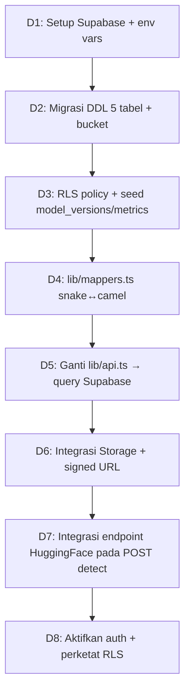

# Planning Model Data — Sistem CitraDetect

Dokumen ini merupakan **rencana implementasi model data** untuk sistem CitraDetect: dari rancangan konseptual ([ERD](Rancangan/ERD.md)) menuju implementasi konkret di Supabase, beserta pemetaan ke tipe TypeScript di frontend ([lib/types.ts](../lib/types.ts)) dan kontrak API backend.

Berbeda dengan [ERD.md](Rancangan/ERD.md) yang bersifat *konseptual* (entitas & relasi), dokumen ini bersifat *operasional*: **DDL siap pakai, urutan migrasi, pemetaan tipe, kebijakan akses, seed data, dan checklist implementasi**.

> **Status saat ini:** UI MVP sudah berjalan penuh dengan **mock data** ([lib/mock-data.ts](../lib/mock-data.ts), [lib/api.ts](../lib/api.ts)). Tujuan dokumen ini adalah memetakan transisi dari mock → model data nyata tanpa mengubah komponen UI.

---

## 1. Tujuan & Prinsip Desain

| No | Prinsip | Konsekuensi Teknis |
| :--- | :--- | :--- |
| P1 | **File tidak masuk database** | Hanya `*_path` (path objek Storage) yang disimpan; biner citra di Supabase Storage |
| P2 | **Model CNN tidak masuk database** | Hanya referensi `hf_repo_id` + metrik; model di-deploy di HuggingFace |
| P3 | **Hasil terikat versi model** | Setiap `detections` menyimpan `model_version_id` agar riwayat tetap valid saat model diperbarui |
| P4 | **Kontrak data stabil** | Bentuk data sama antara DB ↔ API ↔ tipe TS; transisi mock→nyata cukup mengganti [lib/api.ts](../lib/api.ts) |
| P5 | **Penamaan DB = `snake_case`, TS = `camelCase`** | Satu lapisan *mapper* di `lib/mappers.ts` mengonversi keduanya |
| P6 | **Aman sejak awal (RLS)** | Setiap tabel punya Row Level Security; pengguna hanya akses datanya |

---

## 2. Ikhtisar Arsitektur Data

```
┌─────────────────┐   1. upload citra      ┌───────────────────────────┐
│   Next.js (UI)  │ ─────────────────────▶ │  Supabase Storage         │
│                 │                        │  • detection-images       │
│  lib/api.ts     │   2. inference         │  • gradcam-results        │
│  (data access)  │ ─────────────────────▶ ├───────────────────────────┤
│                 │                        │  HuggingFace (CNN + XAI)  │
│  lib/mappers.ts │   3. simpan hasil      ├───────────────────────────┤
│  (snake↔camel)  │ ─────────────────────▶ │  Supabase Postgres        │
└─────────────────┘                        │  5 tabel relasional       │
                                           └───────────────────────────┘
```

**Alur tulis data (Deteksi Citra — R2):**
1. `INSERT detections` (status `processing`) → dapat `id`.
2. Upload citra asli ke bucket `detection-images` dengan path `{user_id}/{id}.{ext}`.
3. Panggil endpoint HuggingFace → terima `prediction`, `confidence`, heatmap.
4. Upload heatmap ke bucket `gradcam-results` dengan path `{user_id}/{id}.png`.
5. `UPDATE detections` → isi hasil + `gradcam_image_path` + status `success`.

---

## 3. Definisi Model Data (DDL Postgres)

Lima tabel + bucket Storage. Urutan eksekusi migrasi mengikuti dependensi FK (§5).

### 3.1 Tabel `profiles`

```sql
create table public.profiles (
  id          uuid primary key references auth.users(id) on delete cascade,
  full_name   text,
  role        text not null default 'researcher'
              check (role in ('researcher', 'general', 'admin')),
  avatar_url  text,
  created_at  timestamptz not null default now(),
  updated_at  timestamptz not null default now()
);
```

> **MVP tanpa auth:** tabel boleh ditunda; `detections.user_id` dibuat *nullable*. Struktur tetap disiapkan agar mudah diaktifkan saat fitur login (`app/(auth)/`) diintegrasikan.

### 3.2 Tabel `model_versions`

```sql
create table public.model_versions (
  id                 uuid primary key default gen_random_uuid(),
  version_name       text not null unique,            -- 'cnn-v1.0'
  hf_repo_id         text not null,                   -- 'tissugalon/citradetect-cnn'
  hf_endpoint_url    text,
  architecture       text,                            -- 'Custom CNN' / 'EfficientNet'
  input_width        int  not null default 224,
  input_height       int  not null default 224,
  num_classes        int  not null default 2,
  class_labels       jsonb not null default '["Asli","AI-Generated"]'::jsonb,
  train_dataset_size int,
  test_dataset_size  int,
  is_active          boolean not null default false,
  trained_at         timestamptz,
  created_at         timestamptz not null default now()
);

-- Hanya satu versi model boleh aktif
create unique index idx_one_active_model
  on public.model_versions (is_active) where is_active = true;
```

### 3.3 Tabel `model_metrics` (1:1 dengan `model_versions`)

```sql
create table public.model_metrics (
  id                 uuid primary key default gen_random_uuid(),
  model_version_id   uuid not null unique
                     references public.model_versions(id) on delete cascade,
  accuracy           numeric(5,4),   -- 0..1
  precision_score    numeric(5,4),   -- 'precision' dihindari (mirip reserved word)
  recall             numeric(5,4),
  f1_score           numeric(5,4),
  cm_true_positive   int,
  cm_true_negative   int,
  cm_false_positive  int,
  cm_false_negative  int,
  evaluated_at       timestamptz not null default now()
);
```

### 3.4 Tabel `training_epochs` (1:N dari `model_versions`)

```sql
create table public.training_epochs (
  id                uuid primary key default gen_random_uuid(),
  model_version_id  uuid not null
                    references public.model_versions(id) on delete cascade,
  epoch_number      int not null,
  train_accuracy    numeric(5,4),
  val_accuracy      numeric(5,4),
  train_loss        numeric(8,6),
  val_loss          numeric(8,6),
  unique (model_version_id, epoch_number)
);
```

### 3.5 Tabel `detections` (tabel inti)

```sql
create table public.detections (
  id                     uuid primary key default gen_random_uuid(),
  user_id                uuid references public.profiles(id) on delete set null,
  model_version_id       uuid references public.model_versions(id) on delete restrict,
  file_name              text not null,
  original_image_path    text,            -- path di bucket detection-images
  gradcam_image_path     text,            -- path di bucket gradcam-results
  file_mime_type         text,
  image_width            int,
  image_height           int,
  file_size_bytes        int,
  prediction             text check (prediction in ('Asli','AI-Generated')),
  confidence             numeric(5,4),    -- 0..1
  execution_time_seconds numeric(6,3),
  preprocessing_info     jsonb default '{"resized_to":[224,224],"normalized":true}'::jsonb,
  status                 text not null default 'processing'
                         check (status in ('processing','success','failed')),
  error_message          text,
  created_at             timestamptz not null default now()
);

create index idx_detections_created_at on public.detections (created_at desc);
create index idx_detections_prediction on public.detections (prediction);
create index idx_detections_user_id    on public.detections (user_id);
```

---

## 4. Supabase Storage (Bucket)

| Bucket | Isi | Akses | Path konvensi | Direferensikan oleh |
| :--- | :--- | :--- | :--- | :--- |
| `detection-images` | Citra asli (JPG/PNG/WebP) | Private (signed URL) | `{user_id}/{detection_id}.{ext}` | `detections.original_image_path` |
| `gradcam-results` | Heatmap Grad-CAM | Private (signed URL) | `{user_id}/{detection_id}.png` | `detections.gradcam_image_path` |

> Untuk MVP tanpa auth, prefix `{user_id}` dapat diganti `anon` atau dihilangkan. Saat hapus baris `detections`, objek Storage terkait juga dihapus (lihat trigger/cleanup di §7).

---

## 5. Urutan Migrasi & Aturan Hapus

**Urutan eksekusi (penting karena dependensi FK):**

```
1. profiles            (independen, ref auth.users)
2. model_versions      (independen)
3. model_metrics       (FK → model_versions)
4. training_epochs     (FK → model_versions)
5. detections          (FK → profiles, model_versions)
6. Bucket Storage + policy
7. RLS policy semua tabel
8. Seed: model_versions + model_metrics + training_epochs
```

**Ringkasan kardinalitas & aturan hapus:**

| Relasi | Kardinalitas | ON DELETE |
| :--- | :--- | :--- |
| `profiles` → `detections` | 1 : N | `SET NULL` (riwayat tetap ada) |
| `model_versions` → `detections` | 1 : N | `RESTRICT` (versi berisi riwayat tak boleh dihapus) |
| `model_versions` → `model_metrics` | 1 : 1 | `CASCADE` |
| `model_versions` → `training_epochs` | 1 : N | `CASCADE` |
| `auth.users` → `profiles` | 1 : 1 | `CASCADE` |

---

## 6. Pemetaan Model Data ↔ Tipe TS ↔ Kontrak API

Ini adalah inti "kontrak data" (Prinsip P4). Lapisan `lib/mappers.ts` menerjemahkan baris DB (`snake_case`) ke tipe TS (`camelCase`) yang sudah dipakai komponen UI.

### 6.1 `detections` → `DetectionResult`

| Kolom DB (`snake_case`) | Field TS ([lib/types.ts](../lib/types.ts)) | Catatan |
| :--- | :--- | :--- |
| `id` | `id` | param rute `/dashboard/detection/[id]` |
| `file_name` | `fileName` | |
| `file_size_bytes` | `fileSize` | |
| `file_mime_type` | `fileMimeType` | |
| `image_width` | `originalWidth` | |
| `image_height` | `originalHeight` | |
| `prediction` | `prediction` | enum `'Asli' \| 'AI-Generated'` |
| `confidence` | `confidence` | `numeric(5,4)` → `number` 0..1 |
| `original_image_path` | `originalImageUrl` | path → **signed URL** saat baca |
| `gradcam_image_path` | `gradcamHeatmapUrl` | path → **signed URL** saat baca |
| `preprocessing_info` | `preprocessing` | `jsonb` → `{ resizedTo, normalized }` |
| `execution_time_seconds` | `executionTimeSeconds` | |
| `created_at` | `createdAt` | ISO string |
| `status`, `error_message`, `model_version_id`, `user_id` | *(belum di tipe TS)* | **perlu ditambahkan** ke `DetectionResult` (§8) |

### 6.2 `model_metrics` + `training_epochs` + `model_versions` → `ModelMetrics`

| Sumber DB | Field TS (`ModelMetrics`) |
| :--- | :--- |
| `model_metrics.accuracy` | `accuracy` |
| `model_metrics.precision_score` | `precision` |
| `model_metrics.recall` | `recall` |
| `model_metrics.f1_score` | `f1Score` |
| `model_metrics.cm_*` | `confusionMatrix.{tp,tn,fp,fn}` |
| `training_epochs[]` | `epochs[]` → `{ epoch, trainAcc, valAcc, trainLoss, valLoss }` |
| `model_versions.{architecture,input_*,class_labels,trained_at,*_dataset_size}` | `modelInfo` |

### 6.3 Kontrak API (tetap sesuai [MVP Plan UI](MVP%20Plan%20UI.md) §7)

| Endpoint | Operasi DB | Halaman |
| :--- | :--- | :--- |
| `POST /api/detect` | `INSERT` + upload Storage + `UPDATE` | R2 |
| `GET /api/model/metrics` | `SELECT` model aktif + join metrics + epochs | R4 |
| `GET /api/history` | `SELECT detections` (paginated, filter, search) | R5, R1 |
| `GET /api/history/{id}` | `SELECT detections WHERE id` + signed URL | R3 |
| `DELETE /api/history/{id}` | `DELETE detections` + hapus objek Storage | R3, R5 |

---

## 7. Row Level Security (RLS) & Kebijakan

```sql
-- Aktifkan RLS
alter table public.profiles        enable row level security;
alter table public.detections      enable row level security;
alter table public.model_versions  enable row level security;
alter table public.model_metrics   enable row level security;
alter table public.training_epochs enable row level security;
```

**Kebijakan utama:**

| Tabel | SELECT | INSERT / UPDATE / DELETE |
| :--- | :--- | :--- |
| `detections` | `auth.uid() = user_id` | `INSERT` dgn `user_id = auth.uid()`; `DELETE` hanya milik sendiri |
| `profiles` | milik sendiri | `UPDATE` milik sendiri |
| `model_versions` / `model_metrics` / `training_epochs` | **publik / authenticated** (read-only, transparansi metrik) | hanya `admin` / service role |

**Storage policy:** objek hanya dapat diakses bila prefix path = `{auth.uid()}/...`.

**Cleanup objek Storage saat hapus baris** (opsional, via trigger atau di [lib/api.ts](../lib/api.ts)): saat `DELETE detections`, hapus juga `original_image_path` & `gradcam_image_path`.

> **Catatan MVP tanpa auth:** jika login belum diaktifkan, gunakan kebijakan permisif sementara (`using (true)`) + service role di server action, lalu perketat saat auth aktif.

---

## 8. Penyesuaian Tipe TS yang Diperlukan

Agar tipe frontend sepenuhnya merepresentasikan model data, [lib/types.ts](../lib/types.ts) perlu ditambah:

```ts
export type DetectionStatus = "processing" | "success" | "failed"

export interface DetectionResult {
  // ... field eksisting ...
  status: DetectionStatus       // BARU — dukung state processing/failed (R2)
  errorMessage?: string | null  // BARU — pesan bila status 'failed'
  modelVersionId?: string       // BARU — versi model penghasil (P3)
  userId?: string | null        // BARU — pemilik (nullable di MVP)
}
```

`ModelInfo` sudah selaras dengan `model_versions` — tidak perlu perubahan.

---

## 9. Seed Data (Data Awal)

Minimal satu versi model aktif + metrik + kurva epoch agar halaman Performa (R4) & Dashboard (R1) berfungsi sebelum ada deteksi nyata. Nilai dapat diambil dari [lib/mock-data.ts](../lib/mock-data.ts) agar tampilan konsisten.

```sql
-- 1 model aktif
insert into public.model_versions
  (version_name, hf_repo_id, architecture, is_active, num_classes,
   class_labels, train_dataset_size, test_dataset_size, trained_at)
values
  ('cnn-v1.0', 'tissugalon/citradetect-cnn', 'Custom CNN', true, 2,
   '["Asli","AI-Generated"]', 8000, 2000, now());

-- metrik (sesuaikan nilai dari mock-data.ts)
insert into public.model_metrics
  (model_version_id, accuracy, precision_score, recall, f1_score,
   cm_true_positive, cm_true_negative, cm_false_positive, cm_false_negative)
select id, 0.942, 0.951, 0.933, 0.942, 470, 472, 24, 34
from public.model_versions where version_name = 'cnn-v1.0';

-- training_epochs: insert 30 baris dari mock-data.ts (epoch 1..30)
```

---

## 10. Rencana Transisi Mock → Nyata (Milestone)



| Tahap | Output | File terdampak |
| :--- | :--- | :--- |
| **D1** | Project Supabase, `.env.local` (`NEXT_PUBLIC_SUPABASE_URL`, `..._ANON_KEY`, service role) | `.env.local`, `lib/supabase/` |
| **D2** | 5 tabel + 2 bucket tereksekusi (§3, §4) | `supabase/migrations/*.sql` |
| **D3** | RLS aktif + seed model (§7, §9) | `supabase/migrations/*.sql` |
| **D4** | Mapper `rowToDetection()`, `rowToMetrics()` | `lib/mappers.ts` (baru) |
| **D5** | `lib/api.ts` query nyata, signature fungsi **tidak berubah** | [lib/api.ts](../lib/api.ts) |
| **D6** | Upload + `createSignedUrl()` untuk citra & heatmap | `lib/api.ts`, `lib/supabase/` |
| **D7** | `POST /api/detect` panggil HF, isi hasil | `app/api/detect/`, `lib/api.ts` |
| **D8** | Auth aktif, `user_id` terisi, RLS diperketat | `app/(auth)/`, policy |

> **Kunci kelancaran:** karena komponen UI hanya memanggil fungsi di [lib/api.ts](../lib/api.ts) dengan signature tetap (`detectImage`, `getMetrics`, `getHistory`, `getDetectionById`, `saveDetection`, `deleteDetection`), seluruh transisi terisolasi di lapisan data — **tidak ada perubahan pada komponen UI**.

---

## 11. Checklist Implementasi

**Database & Storage**
- [ ] Buat project Supabase + simpan kredensial di `.env.local`
- [ ] Eksekusi DDL 5 tabel sesuai urutan §5
- [ ] Buat 2 bucket privat (`detection-images`, `gradcam-results`)
- [ ] Buat index (`created_at`, `prediction`, `user_id`, partial unique `is_active`)
- [ ] Aktifkan RLS + policy per tabel (§7)
- [ ] Seed `model_versions` + `model_metrics` + 30 `training_epochs`

**Lapisan Data Frontend**
- [ ] Tambah field baru di `DetectionResult` (§8)
- [ ] Buat `lib/supabase/client.ts` & `server.ts`
- [ ] Buat `lib/mappers.ts` (snake↔camel + signed URL)
- [ ] Ganti implementasi 6 fungsi di [lib/api.ts](../lib/api.ts) → Supabase

**Integrasi Model**
- [ ] Route handler `POST /api/detect` (upload + HF inference + simpan)
- [ ] Cleanup objek Storage saat `deleteDetection`

**Keamanan (saat auth aktif)**
- [ ] Trigger auto-create `profiles` saat user baru daftar
- [ ] Perketat RLS dari permisif → `auth.uid()`
- [ ] Storage policy berbasis prefix `{user_id}/`

---

## 12. Pemetaan ke Halaman UI

| Halaman | Tabel/Operasi | Fungsi `lib/api.ts` |
| :--- | :--- | :--- |
| R1 Dashboard | agregasi `detections` + `model_metrics` aktif | `getHistory`, `getMetrics` |
| R2 Deteksi | `INSERT`→upload→HF→`UPDATE` | `detectImage`, `saveDetection` |
| R3 Detail | `SELECT detections WHERE id` + signed URL | `getDetectionById`, `deleteDetection` |
| R4 Performa | `model_versions` aktif + `model_metrics` + `training_epochs` | `getMetrics` |
| R5 Riwayat | `SELECT detections` paginated/filter/search | `getHistory`, `deleteDetection` |
| R6 Tentang | statis + `model_versions` aktif | `getMetrics` (modelInfo) |

---

*Referensi: [PRD.md](PRD.md) · [SRS.md](SRS.md) · [ERD.md](Rancangan/ERD.md) · [MVP Plan UI.md](MVP%20Plan%20UI.md)*
