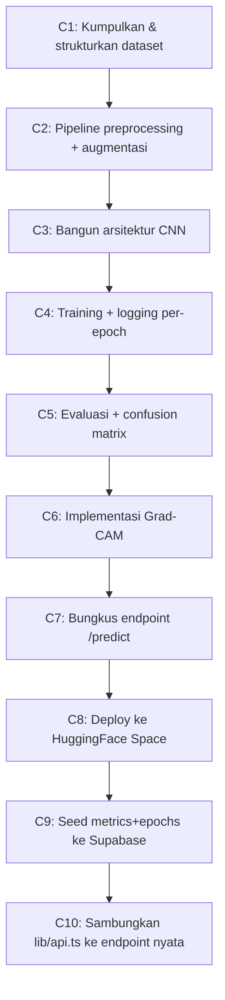

# Planning Model Citra — Sistem CitraDetect

Dokumen ini merupakan **rencana implementasi model citra (CNN + Grad-CAM)** berbasis **Python** untuk sistem CitraDetect: dari penyiapan dataset, pelatihan, evaluasi, sampai *deployment* sebagai *endpoint* inferensi yang dikonsumsi oleh web Next.js.

Berbeda dengan [Planning Model Data.md](Planning%20Model%20Data.md) yang berfokus pada **lapisan penyimpanan** (Postgres + Storage), dokumen ini berfokus pada **lapisan kecerdasan**: bagaimana citra masuk → model klasifikasi → label + peta panas keluar, serta **kontrak** yang harus dipenuhi agar cocok dengan model data yang sudah ada.

> **Status saat ini:** Web MVP sudah berjalan, namun bagian inferensi pada [lib/api.ts](../../lib/api.ts) (`detectImage`) masih **disimulasikan** (`setTimeout` + nilai acak). Tujuan dokumen ini adalah memetakan pembuatan model Python nyata yang **menggantikan simulasi tersebut tanpa mengubah kontrak data** ([lib/types.ts](../../lib/types.ts)).

---

## 1. Tujuan & Prinsip Desain

| No | Prinsip | Konsekuensi Teknis |
| :--- | :--- | :--- |
| M1 | **Model = artefak terpisah dari web** | Model dilatih & disimpan di luar repo Next.js (HuggingFace), web hanya memanggil *endpoint* |
| M2 | **Kontrak inferensi stabil** | Output inferensi selalu memetakan ke `prediction`, `confidence`, `gradcam`, `execution_time`, `preprocessing_info` (lihat §9) |
| M3 | **Sesuai batasan PRD** | Hanya citra statis RGB; klasifikasi biner `Asli` vs `AI-Generated`; CNN sebagai model utama |
| M4 | **Transparan & dapat dijelaskan** | Setiap prediksi disertai Grad-CAM dari *layer* konvolusi terakhir |
| M5 | **Metrik = sumber tabel `model_metrics` & `training_epochs`** | Output evaluasi langsung mengisi seed/insert DB ([Planning Model Data §9](Planning%20Model%20Data.md)) |
| M6 | **Reprodusibel** | `seed` tetap, versi *library* terkunci, konfigurasi terpisah dari kode |
| M7 | **Robust terhadap kompresi Instagram** | Augmentasi mensimulasikan kompresi JPEG & *resize* platform (latar belakang masalah PRD) |

---

## 2. Ikhtisar Arsitektur Model

```
                         ┌──────────────────────────── PYTHON (offline / training) ───────────────────────────┐
                         │                                                                                     │
  Dataset citra ──▶ Preprocessing ──▶  CNN Training ──▶  Evaluasi ──▶  Grad-CAM ──▶  Export bobot (.keras/.pt) │
  (Asli / AI-gen)       (resize 224,      (fit + log         (metrik +     (XAI)          │                    │
                         normalize)        per-epoch)         conf. matrix)               ▼                    │
                         │                     │                  │                  Push ke HuggingFace        │
                         └─────────────────────┼──────────────────┼────────────────────────┬──────────────────┘
                                               │                  │                         │
                                       training_epochs[]    model_metrics             model_versions
                                       (DB)                 (DB)                      (hf_repo_id)
                                                                                            │
                         ┌──────────────────────────── PYTHON (online / serving) ───────────┼──────────────────┐
                         │                                                                  ▼                   │
  Web (lib/api.ts) ─────▶  POST /predict  ──▶ load model ──▶ preprocess ──▶ predict ──▶ Grad-CAM ──▶ JSON+PNG  │
  detectImage(file)      (HF Inference Endpoint / Space)                                                       │
                         └──────────────────────────────────────────────────────────────────────────────────-┘
```

**Dua mode operasi model:**
1. **Offline (pelatihan)** — dijalankan sekali/berkala di notebook/GPU; menghasilkan **bobot model + metrik + kurva epoch**.
2. **Online (inferensi)** — *service* ringan yang menerima 1 citra dan mengembalikan label, *confidence*, dan heatmap Grad-CAM untuk konsumsi web.

---

## 3. Dataset

### 3.1 Komposisi

| Kelas | Label | Sumber | Catatan |
| :--- | :--- | :--- | :--- |
| 0 | `Asli` | Foto asli manusia (mis. dari *feed* Instagram, dataset publik wajah/objek) | Citra RGB, campuran wajah & objek umum |
| 1 | `AI-Generated` | Citra hasil generatif (Midjourney, SD, DALL·E, dsb.) | Disesuaikan agar variatif (wajah & objek) |

> Sesuai batasan PRD §4: **hanya citra statis RGB**, mencakup **wajah manusia dan objek umum**. Tidak ada video/teks.

### 3.2 Pembagian Data (Split)

| Subset | Proporsi | Fungsi | Mengisi field |
| :--- | :--- | :--- | :--- |
| Train | 70% | Pelatihan bobot | `model_versions.train_dataset_size` |
| Validation | 15% | Pemantauan *overfitting* per epoch | `training_epochs.val_*` |
| Test | 15% | Evaluasi akhir (sekali) | `model_versions.test_dataset_size`, `model_metrics.*` |

- Split **stratified** agar proporsi kelas seimbang di tiap subset.
- *Seed* tetap (mis. `42`) demi reprodusibilitas (Prinsip M6).
- Struktur folder disarankan: `data/{train,val,test}/{asli,ai_generated}/*.jpg`.

---

## 4. Preprocessing (Wajib Konsisten Train ↔ Inference)

Langkah preprocessing **harus identik** antara pelatihan dan inferensi agar prediksi valid. Nilai ini mengisi `detections.preprocessing_info` di DB.

| Langkah | Nilai | Alasan |
| :--- | :--- | :--- |
| Decode RGB | 3 channel | Buang alpha/grayscale |
| Resize | `224 × 224` | Sesuai `model_versions.input_width/height` |
| Normalisasi | `pixel / 255.0` (atau mean/std ImageNet bila *transfer learning*) | Stabilitas numerik |
| Tensor | `(1, 224, 224, 3)` | Batch tunggal saat inferensi |

```python
# preprocessing kontrak — dipakai sama di training & serving
IMG_SIZE = (224, 224)

def preprocess(image: PIL.Image) -> np.ndarray:
    img = image.convert("RGB").resize(IMG_SIZE)
    arr = np.asarray(img, dtype="float32") / 255.0
    return np.expand_dims(arr, axis=0)  # (1, 224, 224, 3)
```

**Augmentasi (hanya saat training)** untuk ketahanan terhadap distribusi Instagram (Prinsip M7): kompresi JPEG acak (kualitas 50–90), *random flip horizontal*, sedikit *brightness/contrast jitter*, *downscale-upscale* untuk meniru kompresi platform. Augmentasi **tidak** diterapkan saat validasi/test/inference.

---

## 5. Arsitektur CNN

Dua opsi; pilih salah satu berdasarkan ketersediaan data & target akurasi.

| Opsi | Arsitektur | Kelebihan | Kapan dipakai |
| :--- | :--- | :--- | :--- |
| **A (disarankan awal)** | **Custom CNN** (4–5 blok Conv-BN-ReLU-MaxPool → GAP → Dense) | Ringan, mudah dijelaskan untuk skripsi, Grad-CAM jelas | Dataset menengah, kebutuhan interpretasi tinggi |
| **B** | **Transfer learning** (EfficientNet-B0 / MobileNetV2, *fine-tune*) | Akurasi tinggi dengan data lebih sedikit | Bila akurasi Custom CNN kurang |

**Kerangka Custom CNN (Opsi A):**

```
Input (224,224,3)
→ [Conv2D(32) → BN → ReLU → MaxPool]
→ [Conv2D(64) → BN → ReLU → MaxPool]
→ [Conv2D(128) → BN → ReLU → MaxPool]
→ [Conv2D(256) → BN → ReLU → MaxPool]   ← layer konv. terakhir (target Grad-CAM)
→ GlobalAveragePooling2D
→ Dropout(0.5)
→ Dense(1, activation="sigmoid")          ← output biner (P(AI-Generated))
```

- **Output:** 1 neuron sigmoid → probabilitas kelas `AI-Generated`.
  - `confidence = p` bila `p ≥ 0.5` (prediksi `AI-Generated`), `confidence = 1 - p` bila `p < 0.5` (prediksi `Asli`).
- Mengisi `model_versions.architecture` (`'Custom CNN'` / `'EfficientNetB0'`), `num_classes=2`, `class_labels=["Asli","AI-Generated"]`.

---

## 6. Pelatihan (Training)

### 6.1 Hyperparameter Awal

| Parameter | Nilai awal | Catatan |
| :--- | :--- | :--- |
| Loss | `binary_crossentropy` | Klasifikasi biner |
| Optimizer | `Adam(lr=1e-3)` | Turunkan ke `1e-4` saat *fine-tune* opsi B |
| Batch size | 32 | Sesuaikan memori GPU |
| Epochs | 30 (maks) | Sesuai jumlah seed `training_epochs` di Model Data §9 |
| Callback | `EarlyStopping(patience=5)`, `ModelCheckpoint(best val_acc)`, `ReduceLROnPlateau` | Cegah *overfitting* |
| Class weight | dihitung bila kelas tak seimbang | Jaga recall kedua kelas |

### 6.2 Logging Per-Epoch → tabel `training_epochs`

Setiap epoch mencatat 4 nilai yang **persis** memetakan ke kolom DB:

| Keras `History` | Kolom `training_epochs` | Field TS (`EpochPoint`) |
| :--- | :--- | :--- |
| `accuracy` | `train_accuracy` | `trainAcc` |
| `val_accuracy` | `val_accuracy` | `valAcc` |
| `loss` | `train_loss` | `trainLoss` |
| `val_loss` | `val_loss` | `valLoss` |

Setelah training, *export* `history` → CSV/JSON untuk di-*seed* ke DB (lihat [Planning Model Data §9](Planning%20Model%20Data.md)).

---

## 7. Evaluasi & Metrik → tabel `model_metrics`

Dievaluasi **satu kali** pada subset **test** yang belum pernah dilihat model.

| Metrik | Rumus / Sumber | Kolom DB | Field TS (`ModelMetrics`) |
| :--- | :--- | :--- | :--- |
| Accuracy | `(TP+TN)/total` | `accuracy` | `accuracy` |
| Precision | `TP/(TP+FP)` | `precision_score` | `precision` |
| Recall | `TP/(TP+FN)` | `recall` | `recall` |
| F1-Score | `2·P·R/(P+R)` | `f1_score` | `f1Score` |
| Confusion Matrix | `sklearn.metrics.confusion_matrix` | `cm_true_positive`, `cm_true_negative`, `cm_false_positive`, `cm_false_negative` | `confusionMatrix.{tp,tn,fp,fn}` |

> **Konvensi kelas positif:** `AI-Generated` = positif (kelas 1). Pastikan pemetaan TP/FP/TN/FN konsisten dengan konvensi ini saat menulis ke DB.

```python
from sklearn.metrics import confusion_matrix
y_pred = (model.predict(X_test) >= 0.5).astype(int)
tn, fp, fn, tp = confusion_matrix(y_test, y_pred).ravel()
# → simpan ke model_metrics
```

Semua nilai numerik disimpan `0..1` dengan presisi `numeric(5,4)` (sesuai DDL).

---

## 8. Explainable AI — Grad-CAM

Grad-CAM menjawab kebutuhan **interpretabilitas** (PRD §5, Fitur XAI).

**Algoritma ringkas:**
1. Ambil aktivasi *layer* konvolusi terakhir (`Conv2D(256)` pada §5).
2. Hitung gradien skor kelas prediksi terhadap aktivasi tersebut.
3. *Global-average-pool* gradien → bobot tiap channel.
4. Kombinasi linear berbobot + ReLU → *heatmap* kasar.
5. *Resize* heatmap ke `224×224`, terapkan *colormap* (mis. `JET`), *overlay* di atas citra asli.
6. *Encode* hasil ke **PNG** → diunggah ke bucket `gradcam-results` (`detections.gradcam_image_path`).

```python
def make_gradcam(model, img_array, last_conv="conv2d_3") -> np.ndarray:
    grad_model = tf.keras.models.Model(
        model.inputs, [model.get_layer(last_conv).output, model.output]
    )
    with tf.GradientTape() as tape:
        conv_out, pred = grad_model(img_array)
        loss = pred[:, 0]
    grads = tape.gradient(loss, conv_out)
    weights = tf.reduce_mean(grads, axis=(0, 1, 2))
    cam = tf.reduce_sum(conv_out[0] * weights, axis=-1)
    cam = tf.nn.relu(cam)
    return (cam / tf.reduce_max(cam)).numpy()  # 0..1, di-resize & overlay di serving
```

**Output yang dikirim ke web:** PNG heatmap *overlay* (citra asli + peta panas), siap ditampilkan di halaman R3 Detail.

---

## 9. Kontrak Inferensi (Serving) — Jembatan ke Web

Inilah **kontrak kunci (Prinsip M2)**: bentuk request/response endpoint inferensi yang dikonsumsi `detectImage` di [lib/api.ts](../../lib/api.ts).

### 9.1 Request

```
POST {hf_endpoint_url}/predict
Content-Type: multipart/form-data
  file: <binary image>           # JPG/PNG/WebP, RGB
```

### 9.2 Response (JSON)

```json
{
  "prediction": "AI-Generated",          // "Asli" | "AI-Generated"
  "confidence": 0.9421,                  // 0..1
  "execution_time_seconds": 1.342,
  "preprocessing": { "resized_to": [224, 224], "normalized": true },
  "gradcam_png_base64": "iVBORw0KGgo...", // PNG heatmap overlay (base64)
  "model_version": "cnn-v1.0"
}
```

### 9.3 Pemetaan ke alur web `detectImage` (menggantikan simulasi)

| Field response | Dipakai di [lib/api.ts](../../lib/api.ts) | Kolom DB (`detections`) |
| :--- | :--- | :--- |
| `prediction` | `prediction` | `prediction` |
| `confidence` | `confidence` | `confidence` |
| `execution_time_seconds` | `executionTimeSeconds` | `execution_time_seconds` |
| `preprocessing` | `preprocessing` | `preprocessing_info` |
| `gradcam_png_base64` | decode → upload ke bucket `gradcam-results` | `gradcam_image_path` |
| `model_version` | resolve → `modelVersionId` | `model_version_id` |

> Bagian yang menggantikan blok **"Simulate inference"** ([lib/api.ts:205-222](../../lib/api.ts)): panggilan `fetch(hf_endpoint_url)` menggantikan `setTimeout` + `Math.random`, lalu hasil heatmap base64 di-*upload* alih-alih `picsum.photos`.

---

## 10. Deployment ke HuggingFace

| Aspek | Pilihan | Mengisi |
| :--- | :--- | :--- |
| Repo model | `tissugalon/citradetect-cnn` | `model_versions.hf_repo_id` |
| Mode serving | **HF Space (Gradio/FastAPI)** atau **Inference Endpoint** | `model_versions.hf_endpoint_url` |
| Artefak | `model.keras` / `model.pt` + `config.json` + `app.py` | — |
| Versi aktif | satu model `is_active=true` | `model_versions.is_active` (partial unique index) |

**Disarankan:** HF **Space berbasis FastAPI/Gradio** karena gratis, mudah, dan dapat menjalankan logika Grad-CAM kustom (Inference Endpoint murni kurang fleksibel untuk *post-processing* heatmap).

---

## 11. Struktur Repositori Python (Terpisah dari Web)

```
citradetect-model/
├── data/                      # (gitignored) train/val/test
├── notebooks/
│   └── 01_train_eval.ipynb    # eksplorasi + pelatihan
├── src/
│   ├── config.py              # IMG_SIZE, seed, paths, hyperparams
│   ├── dataset.py             # loader + augmentasi
│   ├── preprocess.py          # kontrak preprocess() (§4)
│   ├── model.py               # definisi CNN (§5)
│   ├── train.py               # training + logging epoch (§6)
│   ├── evaluate.py            # metrik + confusion matrix (§7)
│   ├── gradcam.py             # Grad-CAM (§8)
│   └── export_metrics.py      # history+metrics → JSON untuk seed DB
├── serving/
│   └── app.py                 # FastAPI/Gradio endpoint /predict (§9)
├── artifacts/                 # model.keras, metrics.json, epochs.csv
├── requirements.txt           # versi terkunci (M6)
└── README.md
```

---

## 12. Rencana Pengerjaan (Milestone)



| Tahap | Output | Sesuai dokumen |
| :--- | :--- | :--- |
| **C1** | Dataset terstruktur + split stratified | §3 |
| **C2** | `preprocess.py`, `dataset.py` | §4 |
| **C3** | `model.py` (Custom CNN / transfer) | §5 |
| **C4** | Bobot terbaik + `epochs.csv` | §6 |
| **C5** | `metrics.json` (acc/prec/rec/f1 + CM) | §7 |
| **C6** | `gradcam.py` menghasilkan PNG overlay | §8 |
| **C7** | `serving/app.py` endpoint `/predict` | §9 |
| **C8** | HF Space aktif + `hf_endpoint_url` | §10 |
| **C9** | `model_versions` + `model_metrics` + `training_epochs` terisi | [Model Data §9](Planning%20Model%20Data.md) |
| **C10** | `detectImage` memanggil HF, hapus simulasi | [lib/api.ts](../../lib/api.ts) |

---

## 13. Checklist Implementasi

**Data & Preprocessing**
- [ ] Kumpulkan citra `Asli` & `AI-Generated` (RGB, wajah + objek)
- [ ] Split stratified 70/15/15 dengan seed tetap
- [ ] Implementasi `preprocess()` (resize 224, normalize) — identik train & serving
- [ ] Augmentasi kompresi-Instagram hanya pada train

**Model & Training**
- [ ] Definisikan arsitektur CNN (output sigmoid biner)
- [ ] Latih dengan callback (EarlyStopping/Checkpoint/ReduceLR)
- [ ] Catat `train/val accuracy & loss` per epoch → `epochs.csv`
- [ ] Simpan bobot terbaik (`best val_accuracy`)

**Evaluasi**
- [ ] Hitung accuracy, precision, recall, F1 pada test set
- [ ] Hitung confusion matrix (TP/TN/FP/FN), konvensi `AI-Generated`=positif
- [ ] Export `metrics.json`

**Explainability**
- [ ] Implementasi Grad-CAM pada layer konv. terakhir
- [ ] Hasilkan PNG overlay heatmap

**Serving & Deploy**
- [ ] Endpoint `/predict` mengembalikan JSON kontrak §9
- [ ] Deploy HF Space, catat `hf_repo_id` + `hf_endpoint_url`
- [ ] Set satu `model_versions.is_active = true`

**Integrasi Web**
- [ ] Seed `model_versions`/`model_metrics`/`training_epochs` ke Supabase
- [ ] Ganti blok simulasi di `detectImage` → `fetch` endpoint HF + upload heatmap
- [ ] Uji end-to-end: unggah citra → label + Grad-CAM tampil di R2/R3

---

## 14. Pemetaan Model Citra → Web (Ringkas)

| Komponen Model Python | Konsumen di Web | Halaman UI |
| :--- | :--- | :--- |
| `/predict` (label + confidence) | `detectImage` | R2 Deteksi |
| Grad-CAM PNG | `gradcam_image_path` → signed URL | R3 Detail |
| `model_metrics` (acc/prec/rec/f1 + CM) | `getMetrics` | R4 Performa, R1 Dashboard |
| `training_epochs` (kurva) | `getMetrics` → `epochs[]` | R4 Performa |
| `model_versions.modelInfo` | `getMetrics` → `modelInfo` | R6 Tentang |

---

*Referensi: [PRD.md](../PRD.md) · [SRS.md](../SRS.md) · [ERD.md](../Rancangan/ERD.md) · [Planning Model Data.md](Planning%20Model%20Data.md) · [MVP Plan UI.md](../MVP%20Plan%20UI.md) · [lib/api.ts](../../lib/api.ts) · [lib/types.ts](../../lib/types.ts)*
