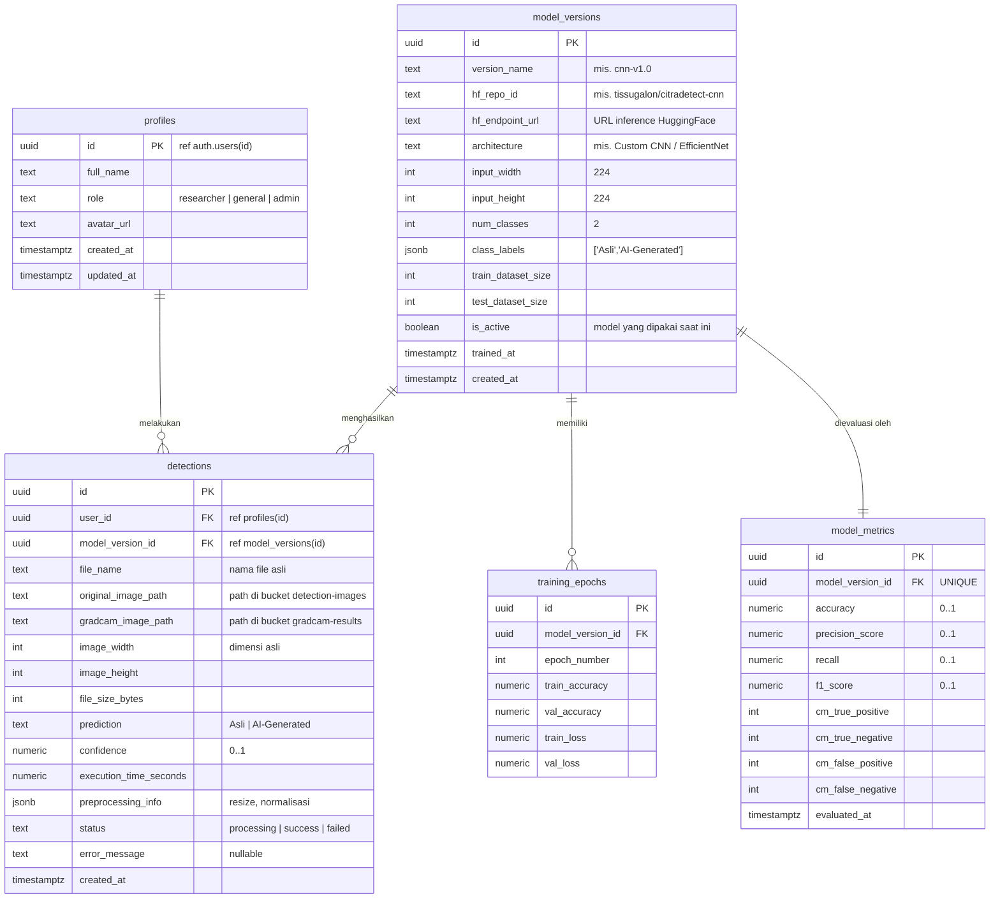

# ERD — Sistem CitraDetect

Dokumen ini berisi *Entity Relationship Diagram* (ERD) untuk sistem **CitraDetect**, dirancang untuk arsitektur:

- **Database:** Supabase (PostgreSQL)
- **Penyimpanan File:** Supabase Storage (citra asli & heatmap Grad-CAM)
- **Model CNN:** Di-deploy di HuggingFace (Inference Endpoint / Spaces), database hanya menyimpan **referensi & hasil**, bukan model itu sendiri.

---

## 1. Gambaran Arsitektur Data

```
┌────────────────┐      upload       ┌──────────────────────┐
│  Next.js (UI)  │ ────────────────▶ │  Supabase Storage    │
│                │                   │  (originals/gradcam) │
│                │      inference    ├──────────────────────┤
│                │ ────────────────▶ │  HuggingFace (CNN)   │
│                │      CRUD         ├──────────────────────┤
│                │ ────────────────▶ │  Supabase Postgres   │
└────────────────┘                   └──────────────────────┘
```

Prinsip desain:
1. **File tidak disimpan di database** — hanya *path* objek Supabase Storage yang disimpan (kolom `*_path`).
2. **Model tidak disimpan di database** — tabel `model_versions` menyimpan referensi `hf_repo_id` ke HuggingFace beserta metrik evaluasinya.
3. Setiap hasil deteksi **terikat pada versi model** yang menghasilkannya, sehingga riwayat tetap valid meskipun model diperbarui.

---

## 2. Diagram ERD (Mermaid)



---

## 3. Deskripsi Entitas

### 3.1 `profiles`
Profil pengguna, satu-ke-satu dengan tabel bawaan `auth.users` Supabase (PK `id` = `auth.users.id`).

| Kolom | Tipe | Keterangan |
| :--- | :--- | :--- |
| `id` | `uuid` PK | Sama dengan `auth.users.id` (FK + cascade delete) |
| `full_name` | `text` | Nama tampilan |
| `role` | `text` | `researcher` (default), `general`, `admin` — sesuai target pengguna PRD §3 |
| `avatar_url` | `text` | Opsional |
| `created_at`, `updated_at` | `timestamptz` | Audit |

> Untuk MVP tanpa autentikasi, tabel ini boleh ditunda dan `detections.user_id` dibuat *nullable*. Namun struktur sudah disiapkan agar mudah diaktifkan.

### 3.2 `model_versions`
Registri versi model CNN yang di-deploy di HuggingFace.

| Kolom | Tipe | Keterangan |
| :--- | :--- | :--- |
| `id` | `uuid` PK | |
| `version_name` | `text` UNIQUE | mis. `cnn-v1.0` |
| `hf_repo_id` | `text` | ID repo HuggingFace, mis. `tissugalon/citradetect-cnn` |
| `hf_endpoint_url` | `text` | URL endpoint inference (Spaces/Inference API) |
| `architecture` | `text` | Deskripsi arsitektur CNN |
| `input_width`, `input_height` | `int` | Ukuran input preprocessing (224×224) — SRS §2 |
| `num_classes` | `int` | 2 |
| `class_labels` | `jsonb` | `["Asli", "AI-Generated"]` |
| `train_dataset_size`, `test_dataset_size` | `int` | Jumlah citra latih/uji (dataset publik + feed Instagram — SRS §3) |
| `is_active` | `boolean` | Hanya satu versi aktif (partial unique index) |
| `trained_at`, `created_at` | `timestamptz` | |

### 3.3 `model_metrics`
Hasil evaluasi satu versi model (relasi **1:1** dengan `model_versions` via UNIQUE FK). Memenuhi SRS §2 "Kalkulasi Metrik Evaluasi".

| Kolom | Tipe | Keterangan |
| :--- | :--- | :--- |
| `model_version_id` | `uuid` FK UNIQUE | → `model_versions.id` |
| `accuracy`, `precision_score`, `recall`, `f1_score` | `numeric(5,4)` | Empat metrik wajib PRD/SRS |
| `cm_true_positive` … `cm_false_negative` | `int` | Empat sel Confusion Matrix 2×2 untuk halaman Performa (R4) |
| `evaluated_at` | `timestamptz` | |

> `precision` adalah *reserved-ish keyword* di Postgres, sehingga dinamai `precision_score`.

### 3.4 `training_epochs`
Titik-titik kurva pelatihan per epoch (relasi **1:N** dari `model_versions`). Menjadi sumber data line chart *Training vs Validation Accuracy/Loss* di halaman Performa.

| Kolom | Tipe | Keterangan |
| :--- | :--- | :--- |
| `model_version_id` | `uuid` FK | → `model_versions.id` |
| `epoch_number` | `int` | UNIQUE bersama `model_version_id` |
| `train_accuracy`, `val_accuracy` | `numeric(5,4)` | |
| `train_loss`, `val_loss` | `numeric(8,6)` | |

### 3.5 `detections` *(tabel inti)*
Setiap satu citra yang dianalisis menghasilkan satu baris. Menjadi sumber data halaman Deteksi (R2), Detail (R3), Riwayat (R5), dan agregasi Dashboard (R1).

| Kolom | Tipe | Keterangan |
| :--- | :--- | :--- |
| `id` | `uuid` PK | Dipakai sebagai param rute `/dashboard/detection/[id]` |
| `user_id` | `uuid` FK | → `profiles.id` (nullable di MVP) |
| `model_version_id` | `uuid` FK | → `model_versions.id` — versi model yang dipakai |
| `file_name` | `text` | Nama file asli unggahan |
| `original_image_path` | `text` | Path objek di bucket `detection-images` |
| `gradcam_image_path` | `text` | Path objek di bucket `gradcam-results` |
| `image_width`, `image_height` | `int` | Dimensi citra asli |
| `file_size_bytes` | `int` | |
| `prediction` | `text` CHECK | `'Asli'` atau `'AI-Generated'` |
| `confidence` | `numeric(5,4)` | 0–1, ditampilkan sebagai persentase |
| `execution_time_seconds` | `numeric(6,3)` | Latensi inference HuggingFace |
| `preprocessing_info` | `jsonb` | mis. `{"resized_to":[224,224],"normalized":true}` |
| `status` | `text` CHECK | `processing` / `success` / `failed` |
| `error_message` | `text` | Diisi jika `failed` (mis. endpoint HF timeout) |
| `created_at` | `timestamptz` | Untuk sort riwayat & tren harian dashboard |

---

## 4. Supabase Storage (Bucket)

Storage bukan entitas relasional, tetapi bagian penting dari desain data:

| Bucket | Isi | Akses | Direferensikan oleh |
| :--- | :--- | :--- | :--- |
| `detection-images` | Citra asli unggahan (RGB: jpg/png/webp) | Private (signed URL) | `detections.original_image_path` |
| `gradcam-results` | Heatmap Grad-CAM hasil inference HF | Private (signed URL) | `detections.gradcam_image_path` |

**Konvensi path:** `{user_id}/{detection_id}.{ext}` — memudahkan kebijakan RLS Storage per pengguna dan pembersihan saat baris `detections` dihapus.

---

## 5. Relasi & Kardinalitas (Ringkasan)

| Relasi | Kardinalitas | Aturan Hapus |
| :--- | :--- | :--- |
| `profiles` → `detections` | 1 : N | `ON DELETE SET NULL` (riwayat tetap ada) atau `CASCADE` sesuai kebijakan |
| `model_versions` → `detections` | 1 : N | `ON DELETE RESTRICT` (versi model tak boleh dihapus jika punya riwayat) |
| `model_versions` → `model_metrics` | 1 : 1 | `ON DELETE CASCADE` |
| `model_versions` → `training_epochs` | 1 : N | `ON DELETE CASCADE` |

---

## 6. Indeks & Kebijakan yang Direkomendasikan

**Indeks:**
- `detections (created_at DESC)` — sort default Riwayat & tren Dashboard.
- `detections (prediction)` — filter Asli/AI di tabel Riwayat.
- `detections (user_id)` — query per pengguna.
- Partial unique: `model_versions (is_active) WHERE is_active = true` — menjamin hanya satu model aktif.
- Unique komposit: `training_epochs (model_version_id, epoch_number)`.

**Row Level Security (RLS):**
- `detections`: pengguna hanya bisa `SELECT/DELETE` baris miliknya sendiri (`auth.uid() = user_id`); `INSERT` dengan `user_id = auth.uid()`.
- `model_versions`, `model_metrics`, `training_epochs`: `SELECT` publik/authenticated (read-only untuk transparansi metrik), tulis hanya oleh `admin`/service role.
- Storage policy mengikuti prefix `{user_id}/` pada path objek.

---

## 7. Pemetaan ERD → Halaman UI (MVP Plan)

| Halaman | Sumber Data |
| :--- | :--- |
| R1 Dashboard | Agregasi `detections` (count, group by prediction, group by tanggal) + `model_metrics.accuracy` model aktif |
| R2 Deteksi Citra | `INSERT detections` (status `processing`) → upload Storage → panggil HF → `UPDATE` hasil + path heatmap |
| R3 Detail Hasil | `SELECT detections WHERE id = :id` + signed URL kedua bucket |
| R4 Performa Model | `model_versions (is_active)` + `model_metrics` + `training_epochs` |
| R5 Riwayat | `SELECT detections` (paginated, search `file_name`, filter `prediction`) |
| R6 Tentang | Statis + sebagian info dari `model_versions` aktif |